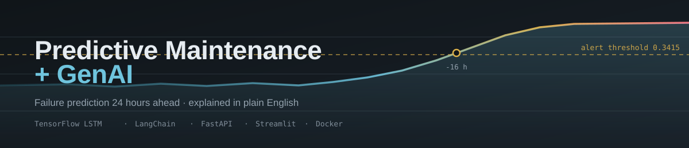
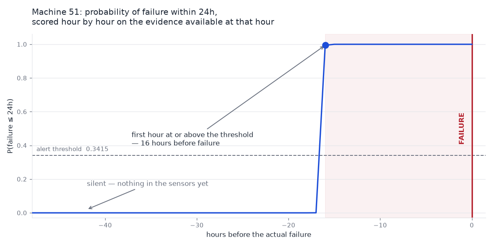

<div align="center">



<h3>Predict equipment failure 24 hours ahead — and explain it in plain English</h3>

<p>
A TensorFlow LSTM scores sensor telemetry; a language model turns each
prediction into a work order a technician can act on. Served over a REST API
with a dashboard, containerised, and tested end to end.
</p>

<!-- Status -->
[](https://github.com/Vanshcloud/Predictive-Maintenance-GenAI/actions/workflows/ci.yml)
[](https://github.com/Vanshcloud/Predictive-Maintenance-GenAI/actions/workflows/codeql.yml)
[](https://github.com/Vanshcloud/Predictive-Maintenance-GenAI/actions/workflows/docs.yml)
[](https://github.com/Vanshcloud/Predictive-Maintenance-GenAI/releases)
[](https://github.com/Vanshcloud/Predictive-Maintenance-GenAI/commits/main)

<!-- Quality -->
[](docs/benchmarks.md#test-suite)
[](docs/benchmarks.md#test-suite)
[](docs/RESULTS.md)
[](https://github.com/psf/black)
[](https://pycqa.github.io/isort/)
[](https://mypy-lang.org/)

<!-- Project -->
[](https://www.python.org/)
[](https://www.tensorflow.org/)
[](https://fastapi.tiangolo.com/)
[](LICENSE)
[](https://github.com/Vanshcloud/Predictive-Maintenance-GenAI/issues)
[](https://github.com/Vanshcloud/Predictive-Maintenance-GenAI/pulls)

<p>
<a href="#quick-start"><b>Quick start</b></a> ·
<a href="docs/README.md"><b>Documentation</b></a> ·
<a href="docs/api.md"><b>API</b></a> ·
<a href="docs/model.md"><b>Model card</b></a> ·
<a href="docs/RESULTS.md"><b>Results</b></a> ·
<a href="docs/roadmap.md"><b>Roadmap</b></a>
</p>

</div>

> **Scope, stated up front.** The dataset is **synthetic**, with a degradation
> pattern deliberately designed to be detectable. The pipeline transfers to real
> telemetry; **these numbers would not.** There is no authentication, so this
> belongs on localhost or a trusted network. Full accounting in
> [`docs/model.md#limitations`](docs/model.md#limitations) and
> [`SECURITY.md`](SECURITY.md).

---

## See it work

Machine 51 failed at 2024-10-31 12:00. This is what the model said about it at
every hour of the two days beforehand — each point scored **only on the
evidence available at that hour**, via the API's `as_of` parameter, so nothing
downstream of the moment leaks in.



It is flat at zero for thirty hours, first flickers at **-17h** (0.0005), and
crosses the alert threshold at **-16h** — sixteen hours of warning on a machine
that gave no earlier sign. Then it saturates and stays there.

The flat part on the left matters as much as the climb. The model was trained
to see 24 hours ahead and no further, so a day before the failure it is silent
and *should* be. That is the horizon, drawn.

Regenerate it yourself. The chart is committed, but so is the script that
draws it — an image nobody can reproduce is the same problem as a status badge
that cannot go red. `data/` and `models/` are gitignored, so a fresh clone
builds them first:

```bash
python scripts/generate_data.py       # ~1 min
python scripts/run_preprocessing.py   # ~3 min
python scripts/train_model.py         # ~81 min on CPU, seeded, reproducible

make docker-up-d                      # or: make run-api, in another shell
pip install -r requirements-dev.txt   # the script needs matplotlib
python scripts/plot_horizon.py                 # machine 51, the chart above
python scripts/plot_horizon.py --machine 96 --failure 2024-11-14T00:00:00
```

Machine 96 crosses at **-23h**, machine 51 at **-16h**. Warning time varies by
how early a machine's sensors start drifting. Across all **8 failure events in
the held-out period the model catches 8**, with a median of **23.5 hours** of
warning and a worst case of 16 — machine 51, the one charted above. The 24
hours in the headline is the ceiling the model was trained to, not a promise
about any one machine.

Or drive it yourself: open the dashboard at `localhost:8501`, turn on **Rewind**
in the sidebar, and set the date to 2024-10-31 hour 6.

---

## Table of Contents

- [See it work](#see-it-work)
- [Overview](#overview)
- [Architecture](#architecture)
- [Features](#features)
- [Tech Stack](#tech-stack)
- [Getting Started](#getting-started)
- [Usage](#usage)
- [Results](#results)
- [Project Structure](#project-structure)
- [Documentation](#documentation)
- [Testing](#testing)
- [Development Progress](#development-progress)
- [Roadmap](#roadmap)
- [Screenshots](#screenshots)
- [FAQ](#faq)
- [Troubleshooting](#troubleshooting)
- [Contributing](#contributing)
- [Citation](#citation)
- [Acknowledgements](#acknowledgements)
- [License](#license)

---

## Overview

> **At a glance:** an LSTM predicts equipment failure 24 hours ahead from four
> sensors, and an LLM turns each prediction into a work order a technician can
> act on. On held-out data it caught **8 of 8 failure events** with a median
> 23.5 hours of warning, at **21 false alarms across 172,800 hourly readings**.
> Predictions serve in **137 ms**; the whole thing runs with no API key.
>
> Full numbers, with their caveats, in **[docs/RESULTS.md](docs/RESULTS.md)**.

Industrial equipment failures cost the global manufacturing industry **$50 billion per year** in unplanned downtime. This project implements a **Predictive Maintenance** system that:

1. **Predicts failures** — Uses an LSTM (Long Short-Term Memory) neural network trained on sensor telemetry data to predict when equipment will fail.
2. **Explains failures** — Uses LangChain + LLM to convert ML predictions into plain-English maintenance reports.
3. **Enables proactive maintenance** — Provides a REST API and interactive dashboard for maintenance teams.

### Why This Project?

| Traditional Approach | This Project |
|---|---|
| Fix equipment **after** it breaks | Predict failures **before** they happen |
| ML model outputs a number (0.87) | GenAI explains: *"Bearing temperature rising 3°C/hr, recommend immediate inspection"* |
| Requires ML expertise to interpret | Maintenance managers can read plain-English reports |
| Isolated scripts | Production-ready API + Dashboard |

---

## Architecture

```
 5 raw sensor tables  (telemetry · machines · errors · maintenance · failures)
          │
          ▼
 DataIngestion → DataValidator → DataPreprocessor
          │        merge · 63 engineered features · 24h labels
          │        temporal split · scale on train only · 24-step windows
          ▼
 LSTM  (128 → 64 → 32 → 1)          class-weighted, {0: 0.50, 1: 364.89}
          │
          ▼
 Predictor          raw tables in → probability + risk band + evidence out
          │         reuses the SAME feature code as training (verified: 100%
          │         alert agreement over 172,800 sequences)
          ▼
 ReportGenerator / MaintenanceAssistant     LangChain · OpenAI|Gemini|Ollama
          │         every figure it cites is supplied; nothing is invented
          ▼
 FastAPI  ── 137 ms predictions ─────────────────────┐
          │  /report isolated so a 21 s LLM call     │
          │  can never delay or break a prediction   │
          ▼                                          ▼
 Streamlit dashboard  ── pure HTTP client, holds no model ──
```

Each layer depends only on the ones above it. `src/data/` imports no
TensorFlow; `src/models/` imports no pandas; the dashboard imports neither.

See [docs/architecture.md](docs/architecture.md) for the detailed architecture diagram.

---

## Features

- 🤖 **LSTM Predictive Model** — TensorFlow-based time-series model for failure prediction
- 🧠 **GenAI Insights** — LangChain-powered natural language maintenance reports
- 🔌 **REST API** — FastAPI with auto-generated OpenAPI documentation
- 📊 **Interactive Dashboard** — Real-time equipment health monitoring (Streamlit)
- ⏪ **Point-in-time assessment** — rewind the fleet to any hour and score it on
  the evidence available then, with everything after it hidden
- 🐳 **Dockerized** — One-command deployment with Docker
- ✅ **Tested** — Unit + integration tests with pytest
- 📝 **Well-Documented** — Comprehensive code documentation and architecture docs

---

## Tech Stack

| Component | Technology |
|---|---|
| ML Framework | TensorFlow / Keras |
| GenAI | LangChain + OpenAI / Ollama |
| API | FastAPI + Uvicorn |
| Dashboard | Streamlit |
| Data Processing | Pandas, NumPy, Scikit-learn |
| Configuration | Pydantic Settings |
| Logging | Loguru |
| Testing | Pytest |
| Code Quality | Black, Flake8, MyPy |
| Containerization | Docker |
| CI/CD | GitHub Actions |

---

## Getting Started

### Prerequisites

- **Python 3.12** — required. TensorFlow publishes no wheels for 3.13+, so a newer
  system Python (e.g. 3.14) **will fail** at install time. On macOS:
  `brew install python@3.12`
- Git
- ~6 GB free disk space (the generated dataset and its processed tensors)
- (Optional) An OpenAI / Google API key for the GenAI features — a local Ollama model
  works with no key at all. The provider packages are optional extras, imported
  lazily, so install the one you want:
  `pip install -e ".[ollama]"` (keyless) or `pip install -e ".[google]"`
- (Optional) Docker for containerized deployment

### Quick Setup

```bash
# 1. Clone
git clone https://github.com/Vanshcloud/Predictive-Maintenance-GenAI.git
cd Predictive-Maintenance-GenAI

# 2a. Automated setup (finds a compatible Python for you)
chmod +x scripts/setup.sh
./scripts/setup.sh

# 2b. …or manually. Note python3.12 explicitly — plain `python3` may be
#     a version TensorFlow does not support.
python3.12 -m venv venv          # macOS: /opt/homebrew/bin/python3.12
source venv/bin/activate
pip install --upgrade pip
pip install -r requirements-dev.txt
cp .env.example .env             # then add an LLM API key if you want reports
```

### Generate the data

The raw and processed datasets are **not** in this repository — together they are
about 6 GB. They are fully reproducible from a fixed seed:

```bash
source venv/bin/activate
python scripts/generate_data.py        # -> data/raw/  (883,231 rows, seed=42)
python scripts/run_preprocessing.py    # -> data/processed/*.npy (~5.2 GB)
```

`data/sample/` is committed and is what the test suite runs against, so `make test`
works immediately after install — but note it deliberately contains **zero** failure
events, so it cannot be used to train or evaluate a model.

### Verify Installation

```bash
# Activate virtual environment
source venv/bin/activate

# Run smoke tests
make test

# See all available commands
make help
```

---

## Usage

```bash
source venv/bin/activate

# Data
python scripts/generate_data.py               # full dataset (100 machines x 365 days)
python scripts/generate_data.py --sample      # small fixture -> data/sample/
python scripts/eda_analysis.py                # 8-dimension exploratory report
python scripts/run_preprocessing.py           # raw CSVs -> LSTM tensors + scaler

# Model
python scripts/train_model.py                 # train, evaluate, write metrics
python scripts/train_model.py --epochs 50 --monitor val_f1 --resume
python scripts/evaluate_model.py              # threshold sweep + curves

# Predict
python scripts/predict.py                     # current fleet status, most urgent first
python scripts/predict.py --machine 47        # one machine, as JSON
python scripts/predict.py --alerts-only -o alerts.csv

# AI maintenance reports
python scripts/generate_report.py --machine 51 --dry-run    # prompt only — no API key needed
python scripts/generate_report.py --machine 51              # full report
python scripts/generate_report.py --fleet

# Ask follow-up questions about one machine
python scripts/ask.py --machine 51
python scripts/ask.py --machine 51 --ask "Has vibration been rising?"

# REST API
make run-api                                  # http://localhost:8000/docs
curl localhost:8000/health
curl localhost:8000/machines/51/predict
curl localhost:8000/fleet?alerts_only=true

# Dashboard (needs the API running)
make run-dashboard                            # http://localhost:8501

# Containers (API + dashboard together)
make docker-build
make docker-up                                # api :8000 · dashboard :8501

# Quality
make test                                     # 241 unit tests
make quality                                  # lint + format-check + typecheck
```

---

## Results

Trained on a three-way chronological split — 567,000 train / 129,000 validation /
172,800 test sequences of shape `(24, 63)`. Early stopping at epoch 28 of 30, best
weights from epoch 23. Wall clock ~81 minutes, CPU-only (Apple Silicon).

Training is **seeded** (`--seed 42`), so these numbers are reproducible rather
than merely reported: `python scripts/train_model.py` re-derives them.

The alert threshold (0.3415) was chosen by sweeping the precision-recall curve on the
**validation** split; the test set is scored once, at that threshold.

| Metric | Value |
|---|---|
| **ROC-AUC** | **0.9999** |
| **Precision** | **0.8976** |
| **Recall** | 0.9200 |
| **F1** | **0.9086** |
| Single-sequence inference | 54 ms median |

Confusion matrix over 172,800 held-out sequences:

```
                 predicted 0   predicted 1
actual 0            172,579            21     <- false alarms
actual 1                 16           184     <- caught 184 of 200 hourly labels
```

### Failures caught, measured over events

Every hour in the 24 hours before a failure carries a positive label, so the
hourly figures above count *hours*, not failures. Measured over failure events —
where catching any hour means the technician was warned:

| Metric | Value |
|---|---|
| Failure events in the test period | 8 |
| **Events warned about** | **8 (100%)** |
| Lead time (median / min / max) | **23.5h / 16h / 24h** |

Eight events is a small sample: this says the model warned in 8 of 8 cases, not
that it never misses. Reported alongside precision, never instead of it —
event recall says nothing about alert fatigue.

**Accuracy is deliberately not reported.** With a 1:864 positive rate a model that
predicts "no failure" every time scores 99.88%, so accuracy would be actively
misleading. Quality is judged on AUC, precision, recall, and F1 only.

### From prediction to work order

Reports are grounded in the engineered features the model actually consumed —
never in the model's imagination. Each sensor line carries an explicit verdict,
and causal explanations are attached *only* when a reading deviates in the
direction that matters:

```
pressure: 65.89 PSI (24h baseline 93.47 PSI, 1.91 sigma below; -32.06 PSI over 24h)
    -> ABNORMAL; typically indicates a leak or a failing seal
rotation: 400.04 RPM (24h baseline 418.31 RPM, 0.33 sigma below)
    -> within normal variation; no action indicated by this sensor
```

Run it with no API key at all: `--dry-run` prints the grounded facts, and a
local Ollama model generates the full report keyless.

> **One caveat, stated plainly.** The dataset is synthetic, with a degradation pattern
> deliberately designed to be detectable. These metrics reflect *this dataset's*
> difficulty, not that of real industrial equipment. The pipeline transfers; the numbers
> would not. Full accounting in [`docs/devlog/day-05.md`](docs/devlog/day-05.md).

---

## Project Structure

```
Predictive-Maintenance-GenAI/
├── README.md                # You are here
├── CONTRIBUTING.md          # Dev setup, quality gates, and the invariants that must hold
├── SECURITY.md              # Threat model and vulnerability reporting
├── CODE_OF_CONDUCT.md       # Contributor Covenant 2.1
├── CHANGELOG.md             # Keep a Changelog format
├── LICENSE                  # MIT
├── Makefile                 # make test / lint / format / typecheck / quality
├── pyproject.toml           # PEP 621 metadata + Black/isort/pytest/mypy/coverage config
│
├── .github/
│   ├── workflows/ci.yml     # Lint, types, tests, image builds, dependency audit
│   ├── ISSUE_TEMPLATE/      # Bug report + feature request forms
│   └── dependabot.yml       # Grouped monthly dependency updates
│
├── config/                  # Centralized configuration (pydantic-settings)
├── src/
│   ├── utils/               # Logging, exception hierarchy
│   ├── data/                # Ingestion, validation, preprocessing + feature engineering
│   ├── models/              # LSTM architecture, training loop, evaluator
│   ├── prediction/          # Predictor: raw tables -> ranked predictions
│   ├── genai/               # LangChain prompts + report chains
│   └── api/                 # FastAPI REST API — 9 endpoints, /docs
├── dashboard/               # Streamlit UI — pure HTTP client of the API
├── docker/                  # Dockerfiles + compose (API and dashboard)
│
├── scripts/                 # Entry points: generate_data, eda, preprocessing,
│                            #   train_model, evaluate_model, predict
├── tests/
│   ├── conftest.py          # Session bootstrap (import order matters — see the file)
│   ├── unit/                # 241 tests, ~27s
│   └── integration/         # 13 tests — parity, grounding, time travel; `make test-integration`
├── docs/
│   ├── README.md                 # Documentation index
│   ├── IMPLEMENTATION_PLAN.md    # Full engineering spec: scope, risks, milestones
│   ├── architecture.md           # Layers, module responsibilities, invariants
│   ├── RESULTS.md                # Every metric, with its caveats
│   └── devlog/                   # Build journal — one entry per milestone
│
├── data/
│   ├── raw/                 # gitignored — regenerate with generate_data.py
│   ├── processed/           # gitignored — regenerate with run_preprocessing.py
│   └── sample/              # committed test fixture (no failure events — by design)
├── models/                  # .keras gitignored; metrics.json + history committed
├── notebooks/               # Jupyter scratch space
└── logs/                    # gitignored, rotated daily
```

The `src/` packages form a strict dependency chain — each may only import from those to
its left, which is what keeps the layers independently testable:

```
config/ -> src/utils/ -> src/data/ -> src/models/ -> src/prediction/ -> src/genai/ -> src/api/ -> dashboard/
```

---

## Documentation

| Document | What it is |
|---|---|
| [`docs/`](docs/README.md) | **Documentation index** — start here |
| [`docs/architecture.md`](docs/architecture.md) | Layer diagram, module responsibilities, and the correctness invariants |
| [`docs/RESULTS.md`](docs/RESULTS.md) | **Every metric in one place**, each with the caveat it needs |
| [`docs/IMPLEMENTATION_PLAN.md`](docs/IMPLEMENTATION_PLAN.md) | Full engineering specification: scope, requirements, dataset, model, deployment plan, risk register, milestones |
| [`docs/devlog/`](docs/devlog/README.md) | Build journal — one entry per milestone, including what went wrong and why |
| [`CONTRIBUTING.md`](CONTRIBUTING.md) | Development setup, quality gates, code style, and the correctness invariants a change must not break |
| [`SECURITY.md`](SECURITY.md) | Threat model, what is and is not hardened, and how to report a vulnerability |
| [`CHANGELOG.md`](CHANGELOG.md) | Release history |

---

## Testing

```bash
make test          # 241 unit tests
make test-cov      # with coverage report
make lint          # flake8
make format        # black + isort (writes)
make quality       # lint + format-check + typecheck (no writes)
```

**Current status: 241 unit + 13 integration tests passing, 0 flake8 issues, mypy clean, Black and isort clean.**

Tests run against the committed `data/sample/` fixture, so they need no generated data.
The first run pays roughly 90 seconds for TensorFlow's initial import on ARM64 macOS;
subsequent runs finish in about 4 seconds.

> `tests/conftest.py` imports TensorFlow before anything else, and that is
> **load-bearing** — not a stray import. TensorFlow and Apache Arrow (pulled in by
> pandas/scikit-learn) each bundle their own copy of abseil, and whichever loads first
> claims the shared symbol for the whole process. Get the order wrong and the suite
> deadlocks at 0% CPU with no traceback. The file explains it in full.

---

## Development Progress

**The 12-day build is complete**, followed by three post-project milestones.

### The build — 12 of 12 days

- [x] **Day 1** — Project setup, folder structure, configuration, logging, testing infrastructure
- [x] **Day 2** — Synthetic dataset (883K rows), exploratory data analysis, ingestion + validation
- [x] **Day 3** — Feature engineering (63 features), labeling, temporal split, LSTM sequencing
- [x] **Day 4** — LSTM architecture, training pipeline, evaluation
- [x] **Day 5** — 3-way split, threshold sweep, training curves, resume — **F1 0.8949**
- [x] **Day 6** — Prediction pipeline — training/serving parity verified, **8/8 failure events caught**
- [x] **Day 7** — LangChain reports — grounded in real sensor evidence, runs keyless on local Ollama
- [x] **Day 8** — Conversational assistant — multi-turn Q&A that declines what the data cannot answer
- [x] **Day 9** — FastAPI REST API — 9 endpoints, **137 ms** predictions, LLM failures degrade gracefully
- [x] **Day 10** — Streamlit dashboard — pure API client, holds no model of its own
- [x] **Day 11** — Docker + GitHub Actions CI — two images (**2.87 GB** API, **803 MB** UI), compose verified
- [x] **Day 12** — Clean-checkout verified, consolidated results, docs complete

### After the build

Enhancement, not construction. Each has its own report in `docs/`.

- [x] **Day 13** — Point-in-time assessment — rewind to any hour; **5/5 alert at 6 h, 0/5 at 36 h**
- [x] **Day 14** — Quality-gate drift and accessibility — local and CI gates unified, two WCAG AA contrast failures fixed, the horizon chart above
- [x] **Day 15** — Full production review — training made reproducible and **retrained seeded** (**F1 0.9086**, t=0.3415), unbounded `/fleet` cache bounded, Windows-safe file I/O

---

## Roadmap

Known limitations, stated rather than discovered. The full list — with status
markers and what is explicitly *not* planned — is in
**[`docs/roadmap.md`](docs/roadmap.md)**.

The short version:

| | |
|---|---|
| 🔴 **Before an untrusted network** | No authentication · no rate limiting · unbounded request bodies |
| 🔴 **Highest value overall** | Validate against a **real** dataset — the numbers here describe a synthetic one |
| 🟡 **Known inefficiencies** | `scripts/predict.py --machine N` scores the whole fleet (~1000× slower than it needs to be) · `explain_machine()` engineers features twice |
| 🟡 **Model** | Not calibrated · no drift detection · never benchmarked against gradient boosting |

---

## Screenshots

The horizon chart at the top of this page is **real output**, produced by a
committed script — see [See it work](#see-it-work).

Dashboard screenshots and a demo GIF are **not yet captured.** Rather than
mock them up, the exact states worth capturing and the commands to produce
them are documented in
[`docs/images/README.md`](docs/images/README.md) — this is a genuinely useful
first contribution.

| | |
|---|---|
| Fleet overview | *placeholder — `docs/images/dashboard-fleet.png`* |
| Machine detail with sensor evidence | *placeholder — `docs/images/dashboard-machine.png`* |
| Generated maintenance report | *placeholder — `docs/images/dashboard-report.png`* |
| Demo walkthrough | *placeholder — `docs/images/demo.gif`* |

Meanwhile, `scripts/evaluate_model.py` writes real training curves and a
precision–recall curve into `models/`, and the dashboard is two commands away:

```bash
make docker-up-d        # http://localhost:8501
```

---

## FAQ

<details>
<summary><b>Is this usable on real equipment?</b></summary>

The pipeline is. The numbers are not transferable — the dataset is synthetic
with a degradation pattern designed to be detectable. Expect substantially
worse performance on real telemetry, which has sensor dropout, calibration
drift, mislabelled failures, and failure modes with no sensor signature at all.
Validating against a real dataset is the top item on the
[roadmap](docs/roadmap.md).
</details>

<details>
<summary><b>Do I need an OpenAI API key?</b></summary>

No. Prediction endpoints never call a language model. Reports work keyless
through a local Ollama model (`pip install -e ".[ollama]"`), and with no
provider at all `/report` returns a `502` that still carries the prediction.
</details>

<details>
<summary><b>Why 0.3415 and not 0.5?</b></summary>

`0.5` is inherited from balanced problems. At a 1:864 positive rate it is
almost never the right operating point. This threshold was chosen by sweeping
the precision–recall curve on the **validation** split; the test set was scored
once, at that point. See [`docs/model.md`](docs/model.md#threshold-selection).
</details>

<details>
<summary><b>Why is accuracy never reported?</b></summary>

Because it would be misleading. At a 1:864 positive rate, predicting "no
failure" every time scores **99.88%**. `ModelEvaluator` does not compute it at
all — quality is judged on AUC, precision, recall, and F1.
</details>

<details>
<summary><b>Why an LSTM rather than XGBoost?</b></summary>

The signal is degradation over time, and flattening a window discards ordering
unless you hand-engineer it back. Honest caveat: gradient boosting was **not**
benchmarked head to head, so "better here" is not a claim this project has
earned. It is on the [roadmap](docs/roadmap.md).
</details>

<details>
<summary><b>Why is training a hand-written loop instead of <code>model.fit()</code>?</b></summary>

History, and it is documented. During Day 4 `fit()` appeared to hang; the real
cause turned out to be an abseil symbol collision between TensorFlow and Apache
Arrow, not Keras. The manual loop is kept because it works, is tested, and makes
class weighting and early stopping explicit — but `fit()` has not been
re-benchmarked since, and the docs say so rather than claiming it is broken.
See [`docs/devlog/day-04.md`](docs/devlog/day-04.md).
</details>

<details>
<summary><b>The dashboard shows "0 alerting". Is it broken?</b></summary>

Almost certainly not. Most hours are quiet, and the dataset's final hour has no
machine inside a pre-failure window. Turn on **Rewind** and set
`2024-10-31` hour 6 — machine 51 goes critical, six hours before it failed.
</details>

<details>
<summary><b>Why does the first test run take 90 seconds?</b></summary>

TensorFlow's initial import on ARM64 macOS. Subsequent runs take ~26 s.
</details>

<details>
<summary><b>Can I use Python 3.13?</b></summary>

No — TensorFlow publishes no wheels for it. Use 3.10, 3.11, or 3.12. This will
follow when upstream does.
</details>

---

## Troubleshooting

Most reported problems are already covered, with the fix, in
**[`docs/troubleshooting.md`](docs/troubleshooting.md)**.

The three that come up most:

| Symptom | Cause |
|---|---|
| `Could not find a version that satisfies the requirement tensorflow` | Python 3.13+. Use 3.12 |
| Training **hangs at 0% CPU** with no traceback | Import order — TensorFlow must load before pandas. [Full diagnosis](docs/troubleshooting.md#the-training-run-hangs-with-no-error) |
| `503` from every endpoint | No trained model. `curl localhost:8000/health` will confirm |

---

## Contributing

Contributions are welcome. [`CONTRIBUTING.md`](CONTRIBUTING.md) covers
development setup, the quality gates, and — most importantly — the correctness
invariants in this codebase that fail silently if broken.

```bash
make setup          # venv + dependencies
make quality        # lint + format-check + typecheck
make test           # unit tests
```

Please read [`SECURITY.md`](SECURITY.md) before reporting anything with a
security dimension, and note the [Code of Conduct](CODE_OF_CONDUCT.md).

---

## Citation

If this project is useful in your work, citing it is appreciated. GitHub also
renders a "Cite this repository" panel from [`CITATION.cff`](CITATION.cff).

```bibtex
@software{tomar_predictive_maintenance_genai_2026,
  author  = {Tomar, Vansh},
  title   = {Predictive Maintenance + GenAI Insight Generator},
  year    = {2026},
  version = {1.0.0},
  url     = {https://github.com/Vanshcloud/Predictive-Maintenance-GenAI},
  license = {MIT}
}
```

> This is a **software** citation. There is no associated paper, and none is
> implied.

---

## Acknowledgements

- The dataset schema follows the shape of Microsoft's **Azure Predictive
  Maintenance** sample — five related tables of telemetry, errors, maintenance,
  machines, and failures. The data here is generated, not that dataset.
- Built on [TensorFlow](https://www.tensorflow.org/),
  [LangChain](https://www.langchain.com/),
  [FastAPI](https://fastapi.tiangolo.com/),
  [Streamlit](https://streamlit.io/),
  [pandas](https://pandas.pydata.org/), and
  [scikit-learn](https://scikit-learn.org/).
- [Keep a Changelog](https://keepachangelog.com/) and
  [Semantic Versioning](https://semver.org/) for release conventions, and the
  [Contributor Covenant](https://www.contributor-covenant.org/) for the code of
  conduct.

---

## License

MIT — see [LICENSE](LICENSE). Use it, fork it, learn from it.

---

## Author

**Vansh Tomar** — [GitHub](https://github.com/Vanshcloud)

Built to demonstrate an end-to-end ML system: not just a model, but the
preprocessing that does not leak, the evaluation that does not flatter, the
service that degrades instead of failing, and the documentation that says what
it does not know.
