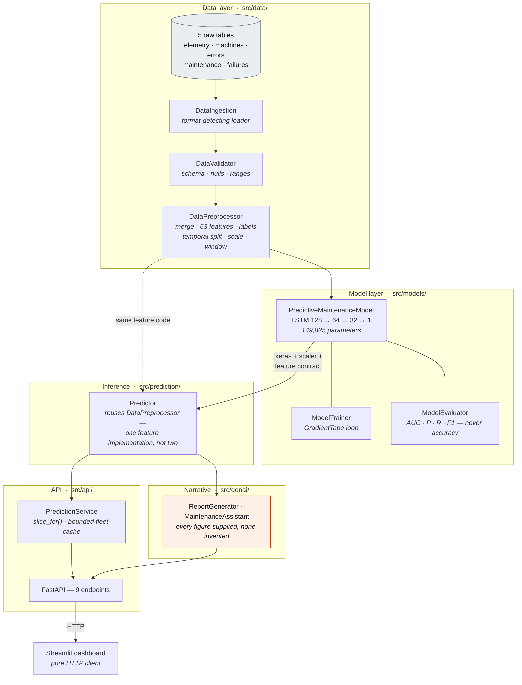
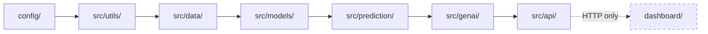
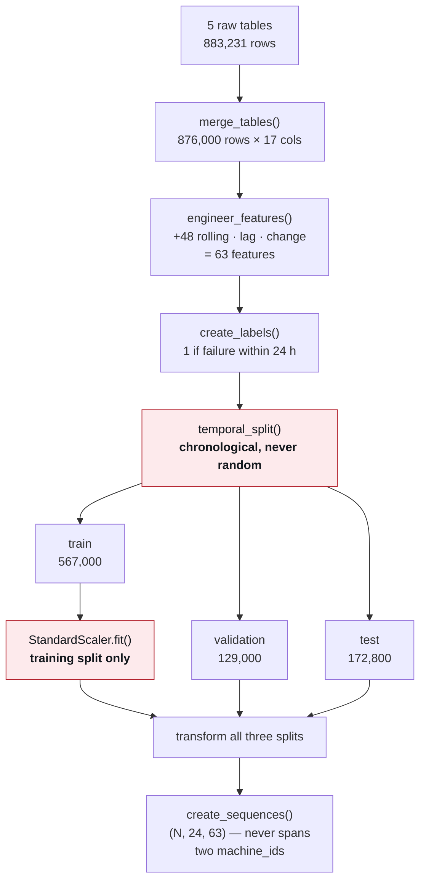
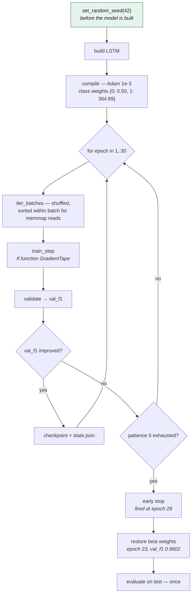
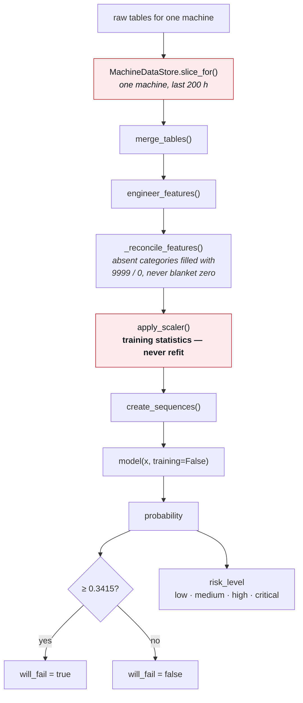
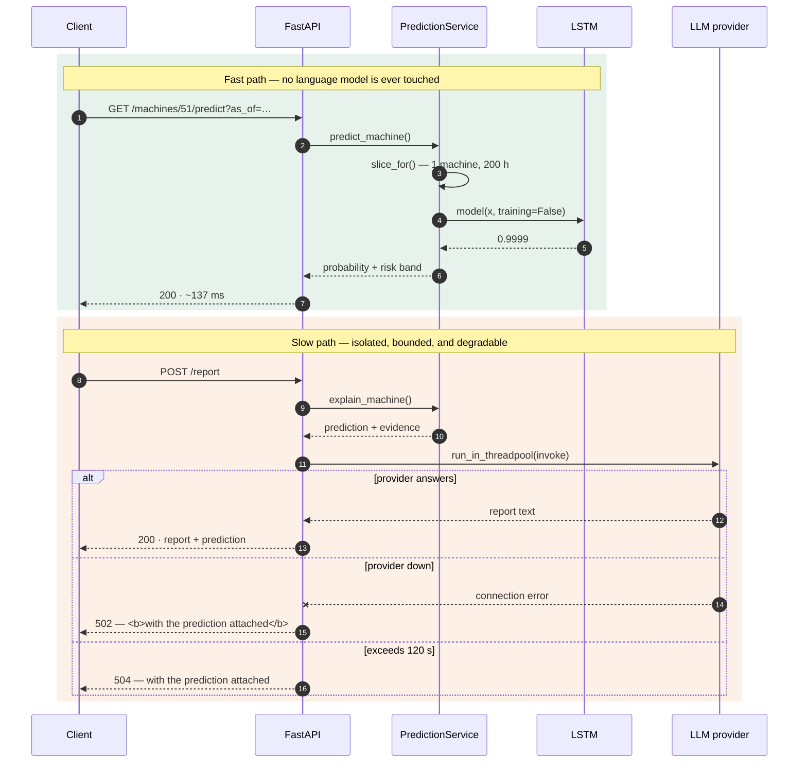

# Architecture Overview

> **Scope of this document.** This is the *design-level* view: layers, responsibilities,
> and how data moves between them. Every layer described here is implemented and tested.
> For the full project history, current status, and the reasoning behind each decision,
> see [`IMPLEMENTATION_PLAN.md`](IMPLEMENTATION_PLAN.md). For how to work on the
> code, see [`../CONTRIBUTING.md`](../CONTRIBUTING.md).

## System Architecture

Eight layers, each depending only on the ones above it. The dashboard is a pure
HTTP client — it imports nothing from `src/`, which is why its container image
is 803 MB against the API's 2.87 GB.



The orange node is the only slow path. Report generation takes ~21 s against a
local model and is isolated in its own router, so it can never delay a
prediction — see [Request lifecycle](#request-lifecycle).

## Layer Dependency Graph

**Each package may import only from packages to its left.** This is enforced by
tests, not convention: `src/data/` imports no TensorFlow, `src/models/` imports
no pandas, and `dashboard/` imports nothing from `src/` at all.



The dashed edge is a process boundary. The dashboard's `Dockerfile` copies only
`dashboard/`, so a future import from `src/` breaks the build — which is the
intended failure.

## Data Flow

From five CSVs to a scored sequence. The ordering of split → scale → window is
deliberate; reversing any two leaks test-period information into training.



The two red steps are where leakage would enter. A random split puts hour *t* in
training and *t+1* in test; fitting the scaler on everything leaks test-period
statistics. Both are pinned by tests.

## Training Pipeline



Seeding happens **before** the model is built, because that is when the LSTM
kernels are drawn from `glorot_uniform`. Without it the quoted F1 is not
reproducible, and an unreproducible headline metric is an unfalsifiable one.

Selection monitors `val_f1`, not `val_auc`: at a ~1:745 positive rate AUC
saturates in the first epochs and then wanders in its fourth decimal place
while precision swings between 0.13 and 0.81. Selecting on a saturated metric
is selecting on noise.

## Prediction Pipeline

Inference **reuses `DataPreprocessor`** rather than reimplementing feature
logic. If that code lived in two places it would drift, and the resulting bug
would be silent — plausible numbers, quietly wrong.



Both red steps are mandatory rather than optimisations. `slice_for()` is the
difference between ~160 ms and over two minutes — without it the endpoint
cannot exist. Refitting the scaler here is the classic training/serving skew
bug, which is why `apply_scaler()` exists separately from `normalize()`.

## Request Lifecycle

Why report generation lives in its own router: a 21-second language-model call
must never be able to delay a 137 ms prediction.



The asymmetry is deliberate. The prediction is what decides whether a
technician is dispatched; the narrative is a convenience over it. An LLM outage
degrades the system to "prediction available, narrative unavailable" — never to
"no answer".

## Technology Stack

| Layer | Technology | Purpose |
|---|---|---|
| Data Processing | Pandas, NumPy | Data manipulation & numerical computing |
| ML Framework | TensorFlow/Keras | LSTM model for time-series prediction |
| ML Utilities | Scikit-learn | Preprocessing, metrics, train/test split |
| GenAI | LangChain + LLM | Report generation, Q&A assistant |
| API | FastAPI + Uvicorn | REST API with auto-generated docs |
| Dashboard | Streamlit | Interactive visualization |
| Configuration | Pydantic Settings | Type-safe config management |
| Logging | Loguru | Structured, rotated logging |
| Testing | Pytest | Unit + integration testing |
| Code Quality | Black, Flake8, MyPy | Formatting, linting, type checking |
| Containerization | Docker | Reproducible deployments |
| CI/CD | GitHub Actions | Automated testing + deployment |

## Design Principles

1. **Separation of Concerns** — Each module handles one responsibility
2. **Dependency Injection** — Components receive dependencies, don't create them
3. **Configuration as Code** — All config in environment variables
4. **Fail Fast** — Validate data early, surface errors immediately
5. **Observability** — Structured logging at every layer

## Layer Dependency Rule

The packages form a strict chain. **Each layer may import only from layers to its left.**
No layer may reach into a later layer's internals, and none may be skipped.

```
config/ -> src/utils/ -> src/data/ -> src/models/ -> src/prediction/ -> src/genai/ -> src/api/ -> dashboard/
```

This is why `src/data/` contains no TensorFlow import and `src/models/` contains no
pandas import, and it is what allows each layer to be tested and deployed independently.

## Module Responsibilities

What each package owns, and the decision inside it that is easy to get wrong.

### `config/settings.py`

A single `Settings` class (pydantic-settings) reading `.env`, reached everywhere through
the cached `get_settings()` factory. Paths, ports, model names, the alert threshold, and
the risk-band boundaries all live here — nothing is hardcoded at a call site.

### `src/utils/`

`logger.py` gives every module `get_logger(__name__)`; there are no bare `print()` calls
in the codebase. `exceptions.py` defines a hierarchy rooted at `PredMaintenanceError` and
grouped by layer (`Data*`, `Model*`, `LLM*`/`Report*`, `API*`), so a caller can catch
precisely or broadly and the API can map failures onto status codes without string
matching on error messages.

### `src/data/`

`DataIngestion` (format-detecting loader) → `DataValidator` (schema, null, duplicate, and
range checks, producing a `ValidationReport`) → `DataPreprocessor`.

`DataPreprocessor` is the largest module in the project. It merges the five raw tables,
engineers 48 rolling, lag, and change features across four sensors, builds 24-hour-horizon
binary labels, performs a **temporal** train/validation/test split, fits `StandardScaler`
on the training split only, and slides 24-step windows into `(N, 24, 63)` tensors.

**The ordering — split, then scale, then window — is deliberate.** Reversing any two of
those steps leaks test-period information into training, and the resulting metrics look
better rather than wrong.

### `src/models/`

`PredictiveMaintenanceModel` defines, saves, and loads the Keras architecture. It is
consumed by `ModelTrainer` and by `ModelEvaluator`, which reports AUC, precision, recall,
F1, and a confusion matrix — never plain accuracy, since positives are roughly 0.13% of
rows.

`ModelTrainer.train()` is a hand-written `GradientTape` loop rather than `model.fit()`,
with early stopping, learning-rate reduction, and checkpointing implemented inline
because Keras callbacks only run inside `fit()`. It is kept because it works, is tested,
and keeps class weighting and callback behaviour explicit and inspectable.

The import order in `src/models/__init__.py` is load-bearing — see
[Two non-obvious gotchas](../CONTRIBUTING.md#two-non-obvious-gotchas).

### `src/prediction/`

`Predictor` loads the model, scaler, and ordered feature contract, then **reuses
`DataPreprocessor`** to reproduce the training feature pipeline at inference time. One
implementation serves both paths; that is the whole defence against training/serving
skew, which is a class of bug that stays silent — the model keeps returning plausible
numbers that are quietly wrong.

`_reconcile_features()` fills categorical columns absent from a scored batch using
per-family defaults: `9999` for `hours_since_maint_*`, `0` for `model_*`. A plain
zero-fill for maintenance recency would read as "serviced this hour", the exact opposite
of "never serviced". Parity with training is asserted over all 172,800 test sequences.

### `src/genai/`

`prompts.py` holds the system prompts and `format_machine_facts()`; `chains.py` composes
the report chain; `assistant.py` handles multi-turn question answering.

Every figure a language model quotes comes from the prediction record it is handed, and
it is given nothing else. An LLM outage degrades to a `502` that still carries the
prediction — **the model's answer never depends on the language model.**

### `src/api/`

`service.py` owns the loaded model and dataset as process-wide state so routes stay thin;
routes map exceptions to status codes through the `PredMaintenanceError` hierarchy.

`MachineDataStore.slice_for()` is mandatory rather than an optimisation: handing the
predictor the full fleet in order to score one machine takes over two minutes, against
roughly 160 ms sliced.

### `dashboard/`

A pure HTTP client. It holds no model, does no scoring, and **must never recompute a risk
band from a probability** — `risk_level` is the API's to assign. Two sources of truth for
that value look correct from either side while destroying trust in both.

## Point-in-Time Assessment (`as_of`)

Every prediction endpoint accepts an optional `as_of` timestamp. `None` means "the latest
reading", which is the default behaviour.

When it is set, `slice_for()` drops everything after that moment — **telemetry, errors,
and maintenance alike.** Filtering telemetry alone would leak, because `errors_last_24h`
and `hours_since_maintenance` are model features. The cutoff is inclusive: the chosen hour
has already happened.

`/fleet`'s cache is keyed by `as_of`. It was a single slot before the feature existed, and
adding the parameter without re-keying would serve a cached present-day answer to a
request about a past date. Because `as_of` is a caller-supplied query parameter on a
public endpoint, the key space belongs to the caller, so the cache is a bounded LRU rather
than a plain dictionary.

## Non-Negotiable Invariants

These are correctness properties, not preferences. Each is enforced by an explicit test,
because every one of them fails *silently* — producing better-looking numbers, not errors.

| Invariant | Why |
|---|---|
| Train/test split is **temporal**, never random | With 24-hour lag features, a random split puts hour `t` in train and `t+1` in test. Reported metrics become fiction. |
| `StandardScaler` is fit on **training data only** | Fitting on the full dataset leaks test-period statistics into training. |
| Sequence windows never span two `machine_id`s | A cross-machine window describes a machine that does not exist. |
| Model quality is judged on **AUC / precision / recall / F1**, never accuracy | At a 1:864 positive rate, "always predict no failure" scores 99.88%. |
| TensorFlow is imported **before** pandas / scikit-learn | They load Apache Arrow, which bundles a conflicting copy of abseil; the wrong order deadlocks the process at 0% CPU with no traceback. |
| The alert threshold is chosen on **validation**; test is scored once | Choosing an operating point on the test set and then reporting test metrics at it is the same mistake as early-stopping on test — the number stops estimating generalisation. |
| `RISK_BAND_HIGH` equals `PREDICTION_THRESHOLD` | "High or above" must mean exactly "the model is alerting", so the band boundary and the alert decision cannot drift apart. |
| `as_of` filtering covers **every** table, not just telemetry | `errors_last_24h` and `hours_since_maintenance` are model features, so filtering telemetry alone leaks the future into a historical assessment. |
| Training is **seeded** before the model is built | The quoted F1 is only meaningful if a second run reproduces it. `keras.utils.set_random_seed` must run before the LSTM kernels are drawn from `glorot_uniform`. |
| `/fleet`'s cache is keyed by `as_of` and stays **bounded** | The key space is caller-supplied, so an unbounded cache grows without limit; an unkeyed one answers questions about the past with the present. |
| The dashboard never derives a risk band itself | Recomputing it from a probability creates a second source of truth that can disagree with the API while looking correct from either side. |
